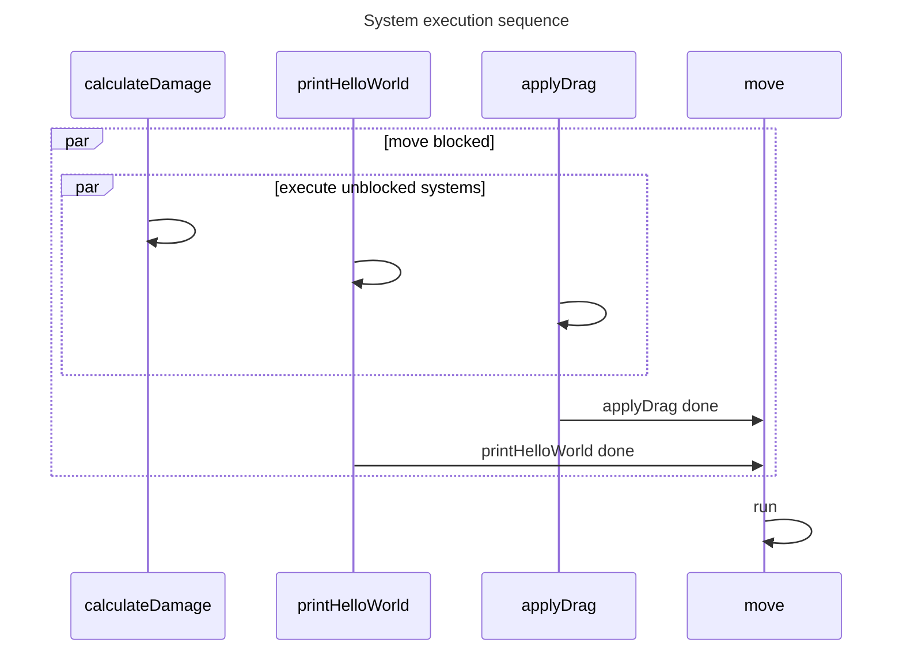
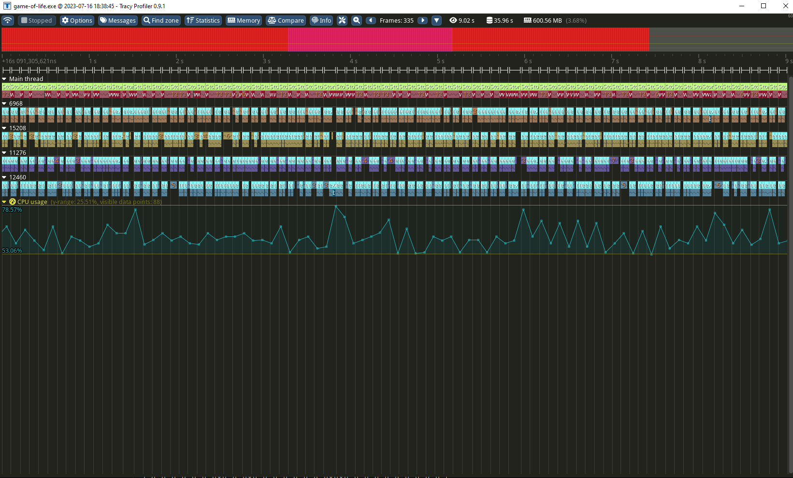

 [](https://github.com/Avokadoen/ecez/actions/workflows/cron.yaml)

# ECEZ - An archetype based ECS API

This is a opinionated WIP ECS (Entity Component System) API for Zig.

## Try it yourself!

### Requirements

The [master branch zig compiler](https://ziglang.org/download/)

### Steps
Run the following commands
```bash
# Clone the repo
git clone https://github.com/Avokadoen/ecez.git
# Run tests
zig build test
# Run GOL example, use '-Denable-tracy=true' at the end to add tracy functionality
zig build run-game-of-life 

```

## Features

As mentioned, the current state of the API is very much Work in Progress (WIP). The framework is to some degree functional and can be played with. Current *implemented* features are:

### Compile time based and type safe API
Zig's comptime feature is utilized to perform static reflection on the usage of the API to validate usage and report useful messages to the user (in theory :)). 

```zig
    // The Storage simply store entites and their components and expose a query API
    const Storage = ecez.CreateStorage(.{
        Health, 
        Attributes,
        Chest,
        Weapon,
        Blunt,
        Sharp,
        // ...
    }, .{});

    // Scheduler can dispatch systems on multiple threads
    const Scheduler = ecez.CreateScheduler(
        Storage,
        .{
            ecez.Event("update_loop", .{
                // Here AttackSystems is a struct with multiple functions which will be registered
                AttackSystems,
                // moveSystem is a single function that will be registered 
                moveSystem,
                // ...
            }, .{}),
            ecez.Event("on_mouse_click", .{fireWandSystem}, .{MouseArg}),
        },
    )

    var storage = try Storage.init(testing.allocator, .{});
    defer storage.deinit();

    var scheduler = Scheduler.init(&storage);
    defer scheduler.deinit();

    scheduler.dispatchEvent(.update_loop, .{}, .{});

    // Dispatch event can take event "scoped" arguments, like here where we include a mouse event.
    // Events can also exclude components when executing systems. In this example we will not call
    // "fireWandSystem" on any entity components if the entity has a MonsterTag component.
    scheduler.dispatchEvent(.on_mouse_click, .{@as(MouseArg, mouse)}, .{ MonsterTag });

    // Events/Systems execute asynchronously
    // You can wait on specific events ...
    scheduler.waitEvent(.update_loop);
    scheduler.waitEvent(.on_mouse_click);
    // .. or all events
    scheduler.waitIdle();

```

#### Special system arguments

Systems can have arguments that has a unique semantical meaning.
Currently there are 3 special arguments:
 * Entity - give the system access to the current entity
 * EventArgument - data that is relevant to an triggered event
 * SharedState - data that is global to the world instance
 * Queries - the same queries described [below](#queries)

 ##### Examples 

Example of EventArgument
```zig
    const MouseMove = struct { x: u32, y: u32,  };
    const OnMouseMove = struct {
        // We see the argument annotated by EventArgument 
        // which hints ecez that this will be supplied on dispatch
        pub fn system(thing: *ThingThatCares, mouse: ecez.EventArgument(MouseMove)) void {
            thing.value = mouse.x + mouse.y;
        }
    };

    const Scheduler = ecez.CreateScheduler(
        Storage,
        .{
            // We include the inner type of the EventArgument when we register the event
            ecez.Event("onMouseMove", .{OnMouseMove}, MouseMove),
        },
    )
    
    // ...

    // As the event is triggered we supply event specific data
    scheduler.dispatchEvent(.onMouseMove, MouseMove{ .x = 40, .y = 2 }, .{});
```

Example of SharedState
```zig
    const OnKill = struct {
        pub fn system(health: Health, kill_counter: *ecez.SharedState(KillCounter)) void {
            health = 0;
            kill_counter.count += 1;
        }
    };

    const Storage = ecez.CreateStorage(
        .{
            // ... Components
        },
        .{
            KillCounter,
        }
    )
    const Scheduler = ecez.CreateScheduler(
        Storage,
        .{
            ecez.Event("onKill", .{OnKill}, .{}),
        }
    );

    var storage = try Storage.init(allocator, .{KillCounter{ .value = 0 }});
```

Example of Entity
```zig
    const System = struct {
        pub fn system(entity: Entity, health: Health) void {
            // ...
        }
    };
```

Example of Query
```zig
    const QueryActiveColliders = StorageStub.Query(.include_entity, .{
        include("position", Position),
        include("collider", BoxCollider),
    }, .{
        InactiveTag, // exclude type
    }).Iter;

    const System = struct {
        // Very bad brute force collision detection with wasted checks (it will check previously checked entities)
        pub fn system(entity: Entity, position: Position, collider: BoxCollider, other_obj: *QueryActiveColliders) void {
            while (other_colliders.next()) |other_collider| {
                // ...
            }
        }
    };
```

You can have multiple queries in a single system, and have systems with only query parameters.

Both SharedState and EventArgument can be mutable by using a pointer

#### System return values

Systems have two valid return types: ``void`` and ``ecez.ReturnCommand``.

``ReturnCommand`` is an enum defined as followed:
```zig

/// Special optional return type for systems that allow systems exit early if needed
pub const ReturnCommand = enum {
    /// System should continue to execute as normal
    @"continue",
    /// System should exit early
    @"break",
};

```


#### System restrictions

There are some restrictions to how you can define systems:
 * If the system takes the current entity argument, then the **entity must be the first argument**
 * **Components must come before special arguments** (event data and shared data, but not entity)
    * Event data and shared data must come *after* any component or entity argument

### Implicit multithreading of systems

When you trigger a system dispatch or an event with multiple systems then ecez will schedule this work over multiple threads. This has implications on how you use systems.
You can use the ``DependOn`` function to communicate order of system execution. 

#### Example:
```zig
    const Scheduler = ecez.CreateScheduler(
        Storage,
        .{
            ecez.Event("update_loop", .{
                // here we see that 'calculateDamage', 'printHelloWorld' and 'applyDrag'
                // can be executed in parallel
                Systems.calculateDamage,
                Systems.printHelloWorld,
                // Apply drag reduce velocity over time
                Systems.applyDrag,
                // Move moves all entities with a Postion and Velocity component. 
                // We need to make sure any drag has been applied 
                // to a velocity before applying velocity to the position. 
                // We also have to make sure that a new "hello world" is visible in the 
                // terminal as well because why not :)                       
                ecez.DependOn(Systems.move, .{Systems.applyDrag, Systems.printHelloWorld}),
            }, .{}),
        },
    );
```




#### Multithreading is done through [zjobs](https://github.com/michal-z/zig-gamedev/tree/main/libs/zjobs)

zjobs is as the name suggest a job based multithreading API. 

### <a name="queries"></a> Queries

You can query the storage instance for components and filter out instances components are paired with unwanted components, as in beloning to the same entity.

#### Example

```zig
const Storage = ecez.CreateStorage(.{
    Monsters,
    HappyTag,
    SadTag,
    AngryTag,
    SickTag,
    HealthyTag
    // ...
}, .{});

var storage = try Storage.init(allocator, .{});

// .. some construction of your entites

const include = ecez.include;

// we want to iterate over all Monsters, HappyTag and HealthyTag components grouped by entity,
// we filter out all monsters that might have the previously mentioned components if they also have 
// a SadTag or SickTag attached to the same entity
var happy_healhy_monster_iter = Storage.Query(
    .exclude_entity,
    // notice that Monster components will be mutable through pointer semantics
    .{
        // these are our include types
        include("monster", *Monster), 
        include("happy", HappyTag), 
        include("healthy", HealthyTag),
    },
    // these are our exclude types
    .{SadTag, SickTag}
).submit(world);

while (happy_healhy_monster_iter.next()) |happy_healhy_monster| {
    // these monsters are not sick or sad so they become more happy :)
    happy_healhy_monster.monster.mood_rating += 1;
}


if (happy_healhy_monster_iter.at(5)) |fifth_happy_monster| {
    // the 5th monster becomes extra happy! 
    happy_healhy_monster.monster.mood_rating += 1;
}

```

### Tracy integration using [ztracy](https://github.com/michal-z/zig-gamedev/tree/main/libs/ztracy)


The codebase has integration with tracy to allow both the library itself, but also applications to profile using a [tracy client](https://github.com/wolfpld/tracy). There is also a wrapper allocator called [TracyAllocator](https://github.com/Avokadoen/ecez/blob/main/src/tracy_alloc.zig) which allows tracy to report on memory usage if the application opts in to it. The extra work done by tracy is of course NOPs in builds without tracy!


### Example

Currently the project has one simple example in the [example folder](https://github.com/Avokadoen/ecez/tree/main/examples) which is an implementation of [conway's game of life](https://github.com/Avokadoen/ecez/blob/main/examples/game-of-life/main.zig) which also integrate tracy

### Test Driven Development

The codebase also utilize TDD to ensure a certain level of robustness, altough I can assure you that there are many bugs to find yet! ;)

### Planned

Please see the issues for planned features.

